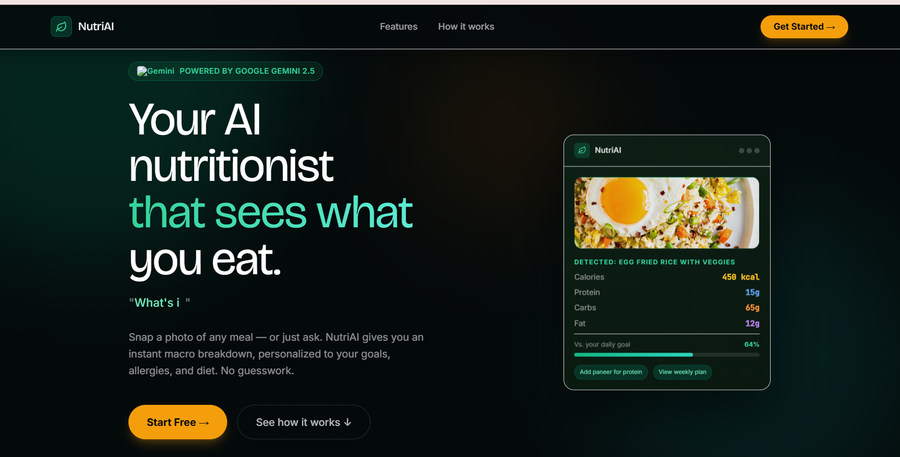
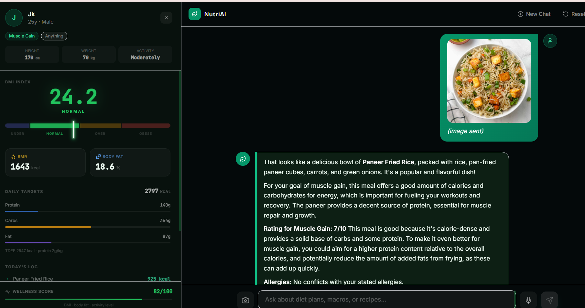
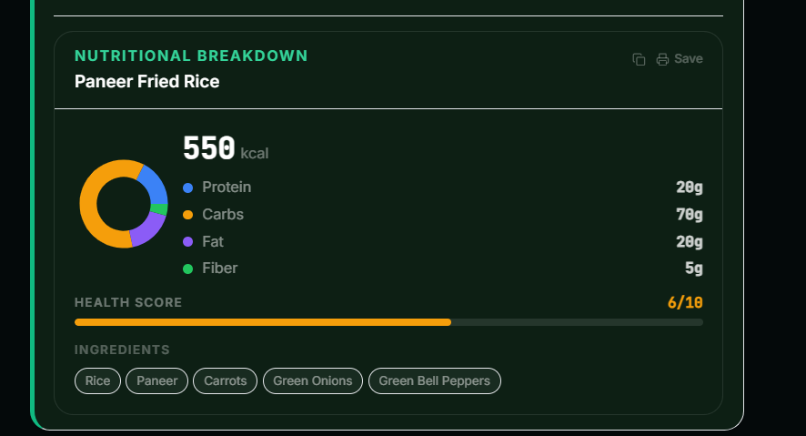

# NutriAI — Your Personal AI Nutritionist

**Live Demo:** [https://nutri-ai-bot.vercel.app/](https://nutri-ai-bot.vercel.app/)

NutriAI is a full-stack AI nutrition assistant. You can upload a food photo or type a question — the AI identifies the dish, breaks down its macros, and gives personalised advice based on your health profile.

---

## Screenshots




---

## Features

### Core AI
- **Dual AI Provider** — Defaults to **Google Gemini 2.5 Flash Lite** (`@google/genai` SDK). Switch to **NVIDIA NIM** (Llama 4 Maverick) via `VITE_AI_PROVIDER=nim`.
- **Multimodal Vision** — Upload any food photo; the AI identifies the dish, estimates portion size, and returns a full macro breakdown.
- **Structured Macro Parsing** — AI responses embed a `[MACROS: calories=N | protein=Ng | carbs=Ng | fat=Ng | dish=... | health_score=N]` tag that the frontend parses automatically to render rich nutrition cards.
- **Streaming Responses** — Real-time token-by-token streaming via SSE with proper buffer flush on stream end.

### Personalisation
- **3-Step Onboarding Wizard** — Collects name, age, gender, height, weight, activity level, fitness goal, dietary preference, and allergies. Stored via Zustand + localStorage.
- **Health Sidebar** — Live-calculated BMI gauge (linear bar with needle), BMR, body fat %, TDEE, and macro targets (protein/carbs/fat) derived from your profile. Today's analysed meals auto-populate from chat history.
- **Goal-aware Macros** — Targets adjust per goal: Weight Loss (−500 kcal, 1.8 g/kg protein), Muscle Gain (+250 kcal, 2.0 g/kg), Athletic Performance (1.6 g/kg), Maintenance (1.4 g/kg).

### Chat Interface
- **Image Upload** — Camera button or drag-and-drop anywhere on the chat window.
- **Voice Input** — Web Speech API; click mic → speak → text fills the input automatically.
- **Macro Cards** — Rich cards auto-render under AI replies containing macro data: donut chart (Recharts), health score bar, ingredient chips, dish name, serving size, and a print/save button.
- **Diet Plan Download** — Detects multi-day meal plans in AI replies and surfaces a "Download Plan" print button.
- **Suggestion Chips** — Context-aware follow-up prompts rendered after each AI response with spring-animated stagger entrance.
- **Rate Limiting** — 30 API calls/day enforced via Vercel KV (Upstash Redis) on the NIM provider path.

### Landing Page
- Full-scroll marketing page with animated hero, bento feature grid, stats bar, how-it-works timeline, and final CTA.
- Indian food context — hero mock card shows Egg Fried Rice with Veggies; typewriter cycles "What's in this thali?", "Is dal good for weight loss?", "How much protein in paneer?"
- Framer Motion animations: word-stagger headline, floating chat mockup card, scroll-triggered section reveals.

---

## Tech Stack

| Layer | Technology |
|---|---|
| **Frontend** | React 18, TypeScript, Vite |
| **Styling** | Tailwind CSS, Framer Motion |
| **State** | Zustand |
| **AI (default)** | Google Gemini 2.5 Flash Lite (`@google/genai`) |
| **AI (alternate)** | NVIDIA NIM — Llama 4 Maverick (`meta/llama-4-maverick-17b-128e-instruct`) |
| **Charts** | Recharts (macro donut + progress bars) |
| **API Proxy** | Vercel Edge Functions (serverless) |
| **Rate Limiting** | Vercel KV (Upstash Redis) — NIM path only |
| **Image Upload** | react-dropzone |
| **Notifications** | react-hot-toast |
| **Icons** | lucide-react |

---

## Prerequisites

- **Node.js** v18+
- **Google Gemini API Key** (default provider) — [Get one here](https://aistudio.google.com/)
- **NVIDIA NIM API Key** (optional) — only needed if switching provider to `nim`
- **Vercel KV Store** (production rate limiting on NIM path only)

---

## Local Development

```bash
cd frontend
npm install
```

Create `frontend/.env`:

```env
# Default provider — Google Gemini 2.5 Flash Lite
VITE_GEMINI_API_KEY=your-gemini-key-here
VITE_AI_PROVIDER=gemini

# Optional — switch to NVIDIA NIM
# VITE_AI_PROVIDER=nim
# VITE_NIM_KEY=nvapi-your-key-here
```

```bash
npm run dev
# → http://localhost:3000
```

> In development the Vite proxy (`/nim-api`) forwards NIM requests directly, bypassing CORS. Gemini calls go directly from the browser using the SDK.

---

## Deployment (Vercel)

1. Push to GitHub.
2. Import project to Vercel — set **Root Directory** to `frontend`, **Framework** to Vite.
3. **Environment Variables** in Vercel dashboard:
   - `VITE_GEMINI_API_KEY` — your Gemini API key
   - `VITE_AI_PROVIDER` — `gemini` (or `nim`)
   - `NIM_KEY` — your NVIDIA key (only if using NIM)
4. **Vercel KV** (only needed for NIM rate limiting) — connect a KV store from the Storage tab. This auto-sets `KV_REST_API_URL` and `KV_REST_API_TOKEN`.

---

## Project Structure

```
/
├── frontend/
│   ├── api/
│   │   └── nim.js                  # Vercel Edge Function — NIM proxy + rate limiting
│   ├── components/
│   │   ├── LandingPage.tsx         # Marketing page (composes sections below)
│   │   ├── LandingPage/
│   │   │   ├── Navbar.tsx          # Glass sticky navbar
│   │   │   ├── Hero.tsx            # Animated hero + floating chat mockup
│   │   │   ├── Features.tsx        # Bento feature grid
│   │   │   ├── HowItWorks.tsx      # 3-step animated timeline
│   │   │   ├── StatsBar.tsx        # Animated stat counters
│   │   │   └── FinalCTA.tsx        # CTA section
│   │   ├── Onboarding.tsx          # Multi-step profile wizard
│   │   ├── ChatWindow.tsx          # Main chat UI — image upload, voice, streaming
│   │   ├── HealthSidebar.tsx       # BMI gauge, macro targets, today's log
│   │   ├── MacroCard.tsx           # Recharts donut + health score card
│   │   └── ConfirmationModal.tsx   # Reset profile dialog
│   ├── services/
│   │   └── geminiService.ts        # Dual-provider LLM service (Gemini + NIM)
│   ├── store/
│   │   └── useAppStore.ts          # Zustand global state
│   ├── lib/
│   │   └── utils.ts                # cn() utility (clsx + tailwind-merge)
│   ├── types.ts                    # Shared TypeScript types
│   ├── constants.tsx               # Lucide icon constants, suggestion chips
│   ├── App.tsx                     # State machine: landing → onboarding → chat
│   ├── index.html                  # Google Fonts (Bricolage Grotesque, Inter, JetBrains Mono)
│   ├── index.css                   # Print rules, custom animations, scrollbar
│   ├── tailwind.config.js          # Custom fonts, colours, animations
│   └── vite.config.ts              # Vite + NIM dev proxy
└── REVAMP_PLAN.md                  # Full UI/UX revamp specification
```

---

## App State Machine

```
'landing' ──[Get Started]──► 'onboarding' ──[Complete]──► 'chat'
                                                              ▲
localStorage profile found ─────────────────────────────────┘
```

---

## ⚠️ Disclaimer

NutriAI is an AI tool for informational purposes only. It is not a substitute for professional medical advice, diagnosis, or treatment. Always consult a qualified healthcare provider regarding any medical condition.
